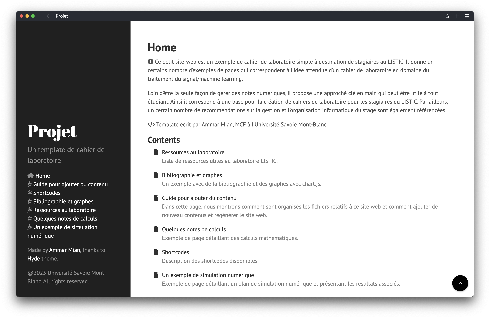

# Template pour cahier de laboratoire

<div style="text-align: center">
    
</div>

Ceci est un projet d'exemple pour générer un cahier de laboratoire à partir de mardown. Une démo en ligne est disponible [ici](https://ammarmian.github.io/template_cahierlabo/).


## Utilisation

Un guide pour modifier le template est disponible en compilant ce code. Une dépendence à hugo-cite est donéne sous fore de submodule. Ainsi pour obtenir tout le code, lancer:

```console
git clone https://github.com/AmmarMian/template_cahierlabo --recurse-submodules
```

### Hugo

Ce template nécessite l'utilisation de [Hugo](https://gohugo.io/). Pour installer Hugo, veuillez suivre les instructions sur le site web.

### Génération du cahier

Pour générer le cahier, il suffit de cloner le projet et de lancer Hugo.
```console
hugo
```
Le dossier `public` contiendra les fichiers générés.

Afin de travailler en mode développement et voir les changements en temps réel, on peut lancer:
```console
hugo server --port <numéro de port>
```
où `<numéro de port>` est le port que vous souhaitez utiliser. Le site web sera ainsi disponible à l'adresse `http://localhost:<numéro de port>` et se mettra à jour à chaque changement dans les fichiers source.


## Auteur

Ce template est fortement basé sur la base du template [Hyde](https://github.com/spf13/hyde).

Ammar Mian
* Web: [http://ammarmian.github.io](http://ammarmian.github.io)
* mail: [ammar.mian@univ-smb.fr](mailto:ammar.mian@univ-smb.fr)

Copyright @Université Savoie Mont Blanc, 2024

